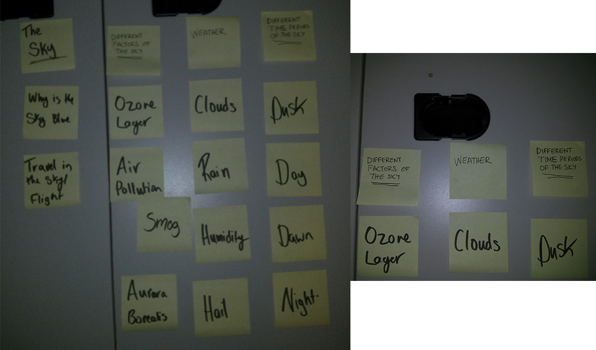
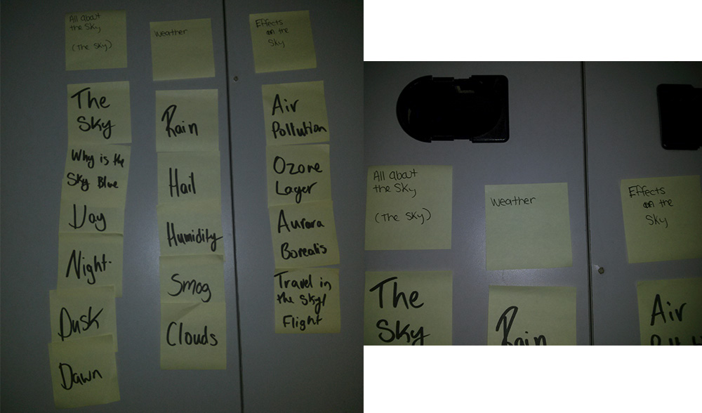

# Card sort report

The purpose of this card sort was to determine common navigation patterns and
categories from the content of my informational website about the sky.

## Specifics

The card sort was conducted by Robyn Rutherford on Tuesday, September 10th between
the times of 9:15 am and 9:45 am with the following participants:

- Mansura Chowdhury
- Lisa Beaton

### Cards

Fifteen cards were used covering a broad range of applicable content for the website. The following topics were used as cards:

1. The Sky
2. Day
3. Night
4. Clouds
5. Rain
6. Why is the sky blue
7. Aurara Borealis
8. Air Pollution
9. Hail
10. Smog
11. Dusk
12. Dawn
13. Ozone Layer
14. Travel in the sky/Flight
15. Humidity

## Card sort results

*Card sort 1 by Mansura Chowdhury*

*Card sort by Lisa Beaton*

## Observations

- Did the participants have any common comments?
  - This is difficult
  - Where should I put this?
- Did they have questions that stood out?
  - Is smog part of the weather?
- Did they struggle with certain articles or topics?
  - Yes they both struggled with where to put travel/flight
  - What to call the sections with the effects in it, like aurura borealis
- Did they find common groupings? Or were the groupings completely different?
  - Ye for the most part the groupings were very similar
- Were some of the groupings completely unexpected?
  - Yes I didn't expect flight to be grouped with the effects
- Were the results similar to your expectations?
  - Yes, they were very similar to my expectations, the only thing was the flight topic
  seemed to be the one lone topic that got thrown some where.
- How did you feel while watching them perform the task?
  - I felt slightly bad because some of the topics seemed to frustrate the card sorters,
  as well as some of the over head topics seemed to stump them as well.
